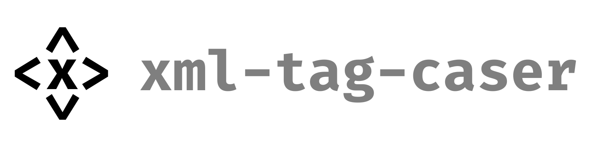

> Command line tool for switching the casing of the XML tags in multiple files at once.

---

## Installation

```shell
npm install -g @staszek998/xml-tag-caser
```

> 💡 You can also utilize this package without the prior installing, by using the `npx`.

## Usage

```shell
xml-tag-caser switch GLOB --from <value> --to <value> [--dry-run] [--omit-html-tags]
```

### Arguments

- `GLOB` - The glob pattern describing the files that are a subject for the casing switch.

### Flags

#### Required

- `--from=<kebab|pascal>` - Which casings should be replaced?
- `--to=<kebab|pascal>` - What is the target casing?

#### Optional

- `--dry-run` - Determines whether the script should perform a dry-run, logging the output to the
  console (instead of modifying the files).
- `--omit-html-tags` - Determines whether the replacer function should omit the standard HTML tags
  and leave them as-is.

### Examples

```shell
xml-tag-caser switch "./**/*.vue" --from kebab --to pascal
```

```shell
xml-tag-caser switch "./**/*.vue" --from pascal --to kebab
```

---

Copyright &copy; 2024 Stanisław Gregor
